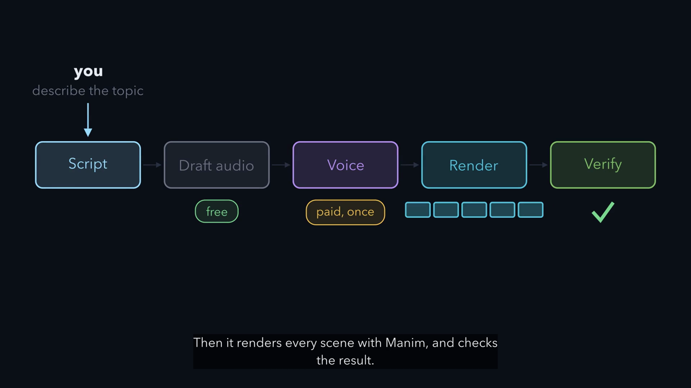

# explainer-video

An agent skill and a small toolkit for making narrated, animated explainer videos: 3Blue1Brown-style [Manim](https://www.manim.community/) diagrams, real screenshots of your apps, an [ElevenLabs](https://elevenlabs.io/) voice, and captions timed to the word.

You describe what the video should explain. The agent writes the script with you, animates it on free placeholder audio, synthesizes the narration once you approve the wording, renders the film, and checks it: decoding, loudness, intelligibility with Whisper, caption timing, and a frame-by-frame review.

The recipe was refined over many revisions of real videos: first cuts, voice upgrades, shorter edits, versions for non-technical audiences, cuts with live app screens, and re-voicing. The lessons from those rounds are written into the skill.

[](docs/explainer-video.mp4)

*A one-minute tour of this repository, made with the skill itself ([MP4](docs/explainer-video.mp4), [captions](docs/explainer-video.srt), [source](examples/repo-tour/)).*

## What you get

For each video, in `out/`:

| File | What it is |
| --- | --- |
| `NAME.mp4` | 1080p30 H.264 + AAC, captions burned in, plus a soft English subtitle track |
| `NAME.srt` | captions timed from the voice's character timestamps |
| `NAME-contact.png` | one frame every 10 seconds, for reviewing the whole film at a glance |
| `NAME-script.md` | the narration by scene, with timestamps |

## How it stays in sync

Scenes are driven by the narration, not by a timeline you maintain by hand:

```python
class Journey(Narrated):
    def construct(self):
        self.say("lb_1")                     # start this sentence's audio
        self.play(FadeIn(nginx), GrowArrow(a1))
        self.until("three app servers")      # wait until the narrator says it
        self.play(LaggedStart(*[FadeIn(a) for a in apps]))
        self.done()                          # wait for the sentence to finish
```

ElevenLabs' `with-timestamps` endpoint returns when every character is spoken. `until` uses those times to start each animation on its word, and the captions are cut from the same times. Change a sentence and re-render: the scene re-times itself.

## Requirements

- Python 3.10+
- ffmpeg, plus Manim's system dependencies (Cairo and Pango; see the [Manim install guide](https://docs.manim.community/en/stable/installation.html)). On macOS: `brew install ffmpeg cairo pango pkg-config`.
- An ElevenLabs API key with text-to-speech access, as `ELEVENLABS_API_KEY`. You only need it for the final narration; drafts use macOS `say` or `espeak-ng` for free.
- Optional: `faster-whisper` for the speech checks (in `requirements.txt`).

## Install the skill

Clone the repo and link the skill into your agent's skills folder. For Claude Code:

```sh
git clone https://github.com/carlosa54/explainer-video.git
ln -s "$PWD/explainer-video/skills/explainer-video" ~/.claude/skills/explainer-video
```

Then ask for a video:

> Make a 2-minute explainer of how our deploy pipeline works, for new engineers. Use screenshots of the Argo dashboard.

> Re-cut the last video to about 90 seconds and drop the database section.

> Re-voice the video with my cloned voice, ID <your-voice-id>.

The skill is plain Markdown plus Python, so other agents that read `SKILL.md`-style skills can use it too, and you can run the toolkit by hand.

## Use the toolkit by hand

```sh
python3 skills/explainer-video/scripts/new_project.py ~/videos/request-journey
cd ~/videos/request-journey
python3 -m venv .venv && . .venv/bin/activate && pip install -r requirements.txt

python -m kit draft              # free placeholder voice
python -m kit build --low --draft  # 480p watermarked preview in out/

export ELEVENLABS_API_KEY=...    # or: op run -- / av inject +ELEVENLABS_API_KEY -- / doppler run --
python -m kit narrate --dry-run  # how many characters this will bill
python -m kit narrate            # real voice, cached by content
python -m kit build              # 1080p final
python -m kit verify --speech    # decode, loudness, Whisper checks
```

The new project contains a working 30-second example ("How a request reaches your app") to change into your own video.

### Commands

| Command | What it does |
| --- | --- |
| `voices [--mine]` | list stock voices, or your own and cloned voices |
| `audition ID[:MODEL] ...` | render the same hard sentence per voice into `build/audition/` |
| `draft` | placeholder narration with even timings, marked as draft |
| `narrate [--dry-run] [--strict-context]` | ElevenLabs narration with timestamps, cached |
| `audio` | trim segments; write durations and alignment for the scenes |
| `render [--low] [Scene ...]` | render scenes in parallel |
| `timing` | scene lengths, and gaps where the voice went silent |
| `assemble [--low] [--draft]` | MP4, SRT, contact sheet and script in `out/` |
| `build [--low] [--draft]` | `audio` + `render` + `assemble` |
| `verify [--low] [--speech]` | decode and loudness; `--speech` adds Whisper checks |

### A project

```
request-journey/
  video.json            title, output name, resolution, voice, fonts
  narration.py          the script: scenes → (id, caption, spoken) segments
  scenes.py             one Manim scene class per script scene
  pronunciations.json   aliases for names the voice gets wrong
  screens/              screenshots used by ScreenScene
  kit/                  the toolkit, vendored (copied fresh into each new project)
  build/                intermediates (ignored)
  out/                  deliverables
```

`video.json`:

```json
{
  "name": "request-journey",
  "title": "How a request reaches your app",
  "resolution": [1920, 1080],
  "fps": 30,
  "voice": {
    "voice_id": "JBFqnCBsd6RMkjVDRZzb",
    "voice_name": "George",
    "model_id": "eleven_multilingual_v2",
    "settings": {"stability": 0.55, "similarity_boost": 0.75, "style": 0.1, "use_speaker_boost": true, "speed": 1.0},
    "seed": 7,
    "context": true,
    "audition_text": "nginx forwards the request to one of three replicas in about forty milliseconds."
  },
  "whisper_prompt": "nginx, DNS, Postgres"
}
```

Optional keys: `font`, `mono_font`, `pause` (seconds between sentences, default 0.22), `cue_lead` (how early a cue fires, default 0.12), `loudness` (default −16 LUFS), `captions` (`burn`, `line` width, `size`), and `voice.output_format` (default `mp3_44100_128`).

### Script format

```python
SCENES = {
    "Journey": [
        ("dns_1", "First, DNS turns the name into an address."),
        ("lb_1",
         "nginx picks one of 3 app servers.",       # caption: what viewers read
         "nginx picks one of three app servers."),  # spoken: what the voice says
    ],
}
```

Captions and spoken text must have the same sentences; captions are timed sentence by sentence from the spoken audio.

### Rebuild the tour video

The tour above is a project like any other. Its script and scenes are in `examples/repo-tour/`:

```sh
python3 skills/explainer-video/scripts/new_project.py ~/videos/tour --from examples/repo-tour
cd ~/videos/tour
python -m kit narrate && python -m kit build   # about 800 characters of narration
```

### New cuts and new voices

```sh
python3 skills/explainer-video/scripts/new_project.py ~/videos/request-journey-short --from ~/videos/request-journey
```

Each cut is its own folder, so earlier versions stay playable. Narration is cached in `~/.cache/explainer-video/tts` (set `EXPLAINER_TTS_CACHE` to move it), keyed on the voice, settings and text. A new cut pays only for sentences that changed. To change the voice, edit `voice` in the new cut's `video.json` and run `narrate` and `build`. The scenes re-time to the new pacing on their own.

## Cost and keys

- `narrate --dry-run` shows the billable characters before anything is spent. A 3-minute video is about 2,500 characters.
- The key is read from the environment only. It is never printed, logged or written to disk, and it is scrubbed from error messages. Use a secret manager rather than putting it in your shell history.
- The toolkit needs only text-to-speech permission. Pronunciation aliases are applied locally, so a key without dictionary or model-listing permissions works.
- Use stock voices, or your own cloned voice. Don't clone or imitate someone else's voice without their consent.

## Repository layout

```
skills/explainer-video/
  SKILL.md            the steps the agent follows
  references/         script, narration, animation, screen capture, verification
  scripts/new_project.py
  template/           the example project and the kit
examples/repo-tour/   source of the tour video
docs/                 the rendered tour video, its captions and poster
```

## License

MIT
